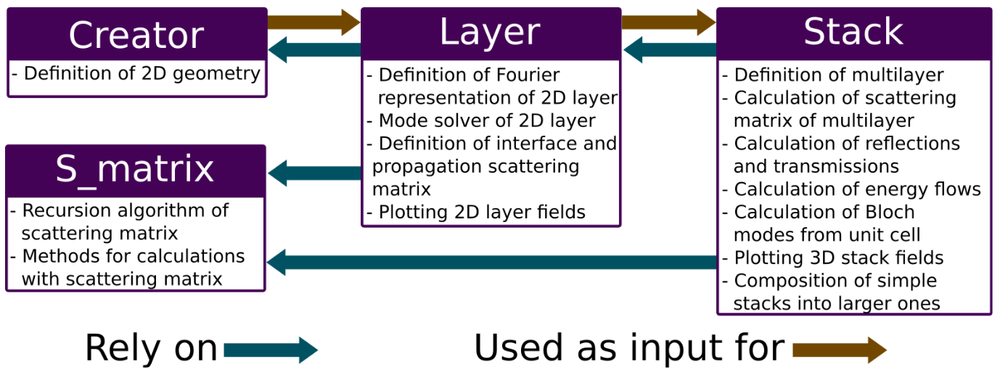

Introduction
=============

This is the draft documentation for the A_FMM package. It is a work in progress. Any suggestion for improvements is welcome. 

Installation
-------------
To install the packages dependencies, just use the provided **requirements.txt** file, by running:

.. code-block::
    
    pin install -r requirements.txt

Then, just make sure the folder A_FMM is added to the PYTHONPATH environment variable.

Method Overview
-----------------
The A-FMM method as we know it appeared in the mid 2005 [#]_. It builds on the Fourier modal method for crossed gratings [#]_, which combines Fourier methods with the well-known scattering matrix algorithm [#]_. The novelty of the A-FMM is the addition of a coordinate transformation to map the unit cell of the grating to the full ℝ2 space, thus allowing the modeling of aperiodic structures. The transformation exists in real and complex variants [#]_, where the latter behaves as a PML and thus allows for the treatment of structure with high scattering loss. The implementation in this paper complements these core functionalities with methods for calculating Bloch modes from the scattering matrix of the unit cell [#]_ and a custom method for calculating Poynting vectors and energy flows [#]_. 

This implementation aims at providing easy access to the A-FMM method to as many people as possible. Therefore, it is implemented in Python3, making this tool easy to install and portable across different platforms. It makes use of classes for a simple and modular structure (figure below). Being heavily based on numpy [#]_ and scipy [#]_ libraries, it uses well tested numerical routines known for their efficiency, stability and scalability.

Moreover, this implementation was battle tasted on HPC system and was employed during research activities leading to published papers [#]_ [#]_ [#]_.

Structure of the A-FMM code. Blocks  represent Python classes and arrows the relations between them.

.. [#] Hugonin, J. P., et al. "Fourier modal methods for modeling optical dielectric waveguides." Optical and quantum electronics 37.1 (2005): 107-119.
.. [#] Li, Lifeng. "New formulation of the Fourier modal method for crossed surface-relief gratings." JOSA A 14.10 (1997): 2758-2767.
.. [#] Li, Lifeng. "Formulation and comparison of two recursive matrix algorithms for modeling layered diffraction gratings." JOSA A 13.5 (1996): 1024-1035.
.. [#] Hugonin, Jean Paul, and Philippe Lalanne. "Perfectly matched layers as nonlinear coordinate transforms: a generalized formalization." JOSA A 22.9 (2005): 1844-1849.
.. [#] Li, Zhi-Yuan, and Lan-Lan Lin. "Photonic band structures solved by a plane-wave-based transfer-matrix method." Physical Review E 67.4 (2003): 046607.
.. [#] Passoni, Marco. "Theoretical study of integrated grating structures for Silicon Photonics."
.. [#] Harris, Charles R., et al. "Array programming with NumPy." Nature 585.7825 (2020): 357-362.
.. [#] Virtanen, Pauli, et al. "SciPy 1.0: fundamental algorithms for scientific computing in Python." Nature methods 17.3 (2020): 261-272.
.. [#] Passoni, Marco, et al. "Optimizing band-edge slow light in silicon-on-insulator waveguide gratings." Optics Express 26.7 (2018): 8470-8478.
.. [#] Passoni, Marco, et al. "Slow light with interleaved pn junction to enhance performance of integrated Mach-Zehnder silicon modulators." Nanophotonics 8.9 (2019): 1485-1494.
.. [#] Fornasari, Lucia, et al. "Angular dependence and absorption properties of the anapole mode of Si nano-disks." Journal of Applied Physics 129.2 (2021): 023102.